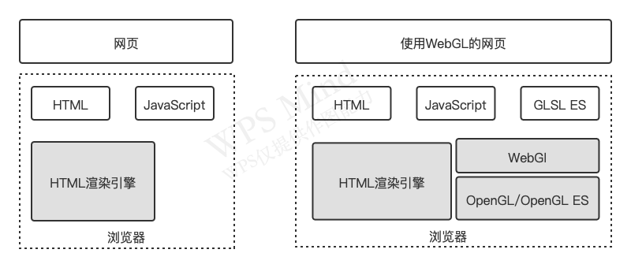

# 第1章 WebGl概述
传统意义上的三维图形的显示需要开发者使用`C`或者`C++`语言，使用计算机图形库，如`OpenGl`或`Direct3D`来完成一个三维图形的应用程序。
如今WebGl之所以能够在web端进行使用，是借助了HTML5移入的`<canvas>`标签。`canvas`的出现意味着web端可以支持JavaScript动态的绘制图形。   

## WebGl的优势
- 无需任何浏览器插件即可在web端使用
- 它能利用底层的图形硬件加速功能进行的图形渲染，是通过`OpenGl`实现的。
- 在2d动画方面可以使用`canvas`或者`js的dom操作`这些技术去实现，但是这种两种技术都是`CPU`去进行计算和渲染的。WebGl使用的是`GPU`进行计算和图形的渲染，`CSS3`中部分属性也是通过`GPU`去渲染的。`GPU的计算能力要远超CPU的`。

## WebGL的起源
计算机上使用的最广泛的两种三维图形渲染技术：`Direct3D`和`OpenGl`。   
- `Direct3D`是微软`DirectX`技术的一部分，主要用于`Windows`平台。   
- `OpenGl`有`开放`和`免费`的特性，导致它可以在多种平台上使用。Windows对OpenGl也提供了良好的支持，可以用它代替Direct3D。

`WebGl基于OpenGl`，它是从OpenGl的一个特殊版本`OpenGl ES`中派生出来的。WebGl1.0是基于OpenGl ES2.0，WebGl2.0是基于OpenGl ES3.0。目前浏览器上使用的WebGl是2.0版本的。  
下图是OpenGl、OpenGl ES和WebGl的关系：
 

OpenGl从2.0版本之后开始支持`着色器`，该特性被OpenGl ES 2.0继承，进而成为了WebGl 1.0标准的`核心部分`。  
`着色器`是一种类似于C的编程语言，编写着色器的语言又称为`着色器语言`。OpenGl ES 2.0基于OpenGl 着色器语言（`GLSL`），因而被称为OpenGl ES 着色器语言（`GLSL ES`）。WebGl基于OpenGL ES，使用的也是GLSL ES编写着色器。  

## WebGl程序的结构
传统的动态网页使用两种语言：HTML和JavaScript。WebGl页面使用三种语言：HTML5、JavaScript和GLSL ES。  
下图是传统动态网页和WebGl网页的软件结构  
