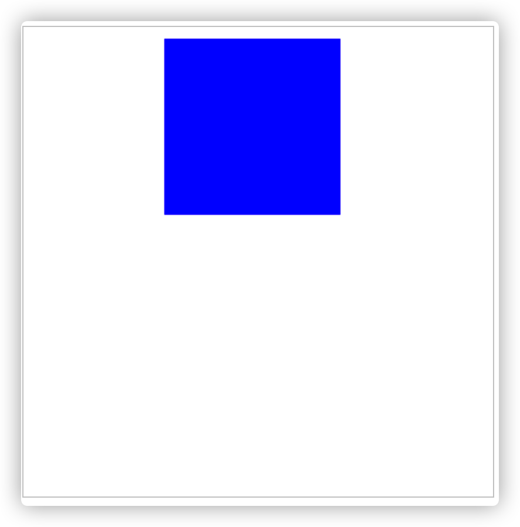
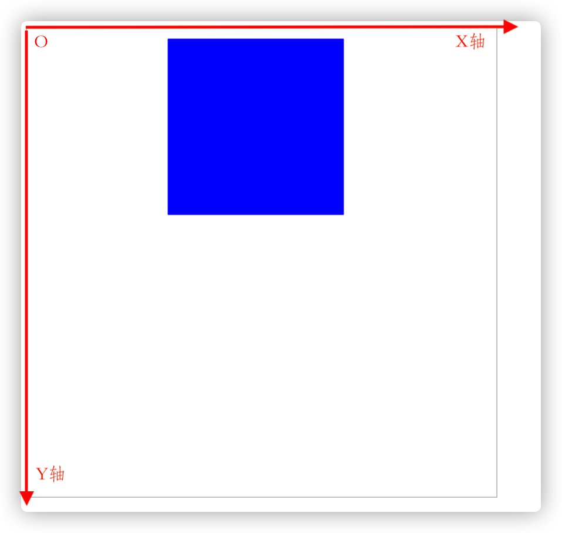
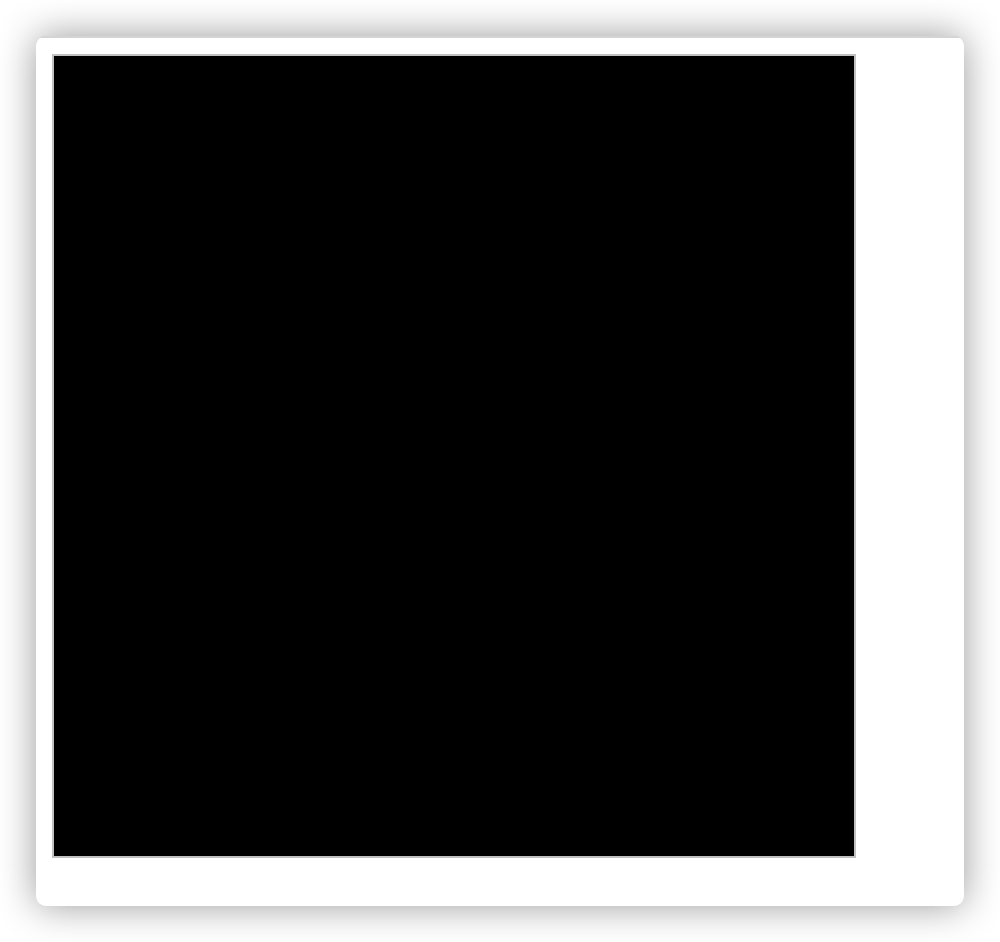
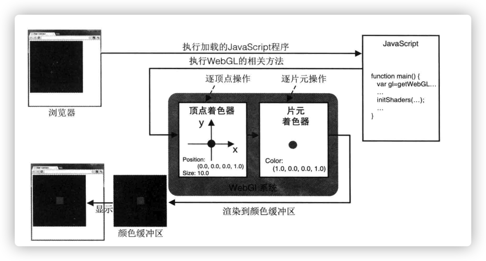

# 第2章 WebGL入门
## <div id='canvas'>什么是Canvas？</div>
HTML5之前网页想要显示图像只能用HTML提供的原生的``标签,但只能显示静态的图片，不能进行实时的绘制和渲染。HTML5出现之后，引入了`<canvas>`标签，允许JavaScript动态地绘制图形。

## 使用`<canvas>`标签
`<canvas>`标签的的宽高是通过标签的`width`和`height`定义的，使用`css`的style定义是`无效`的。如下面例子定义了canvas的宽高为400px：
```html
<canvas id='example' width='400' height='400'></canvas>
```
错误例子：
```html
<style>
canvas{
    width: 400px;
    height: 400px;
}
</style>
<canvas id='example'></canvas>
```
当canvas为定义宽高时，默认的宽度为`300px`，高度为`150px`。默认情况下`<canvas>`是透明的，如果不用JavaScript上画什么的话，这样情况下是看不到的。  
`<canvas>`上绘制二维图形只需以下三步：
1. 获取`<canvas>`元素
2. 向该元素请求二维图形的”绘图上下文“
3. 在绘图上下文上调用相应的程序，以绘制二维图形
例子如下：
```js
function main(){
    // 获取canvas元素
    var canvas = document.getElementId('example');
    if(!canvas){
        console.log('该浏览器不支持canvas');
        return;
    }
    // 获取绘图上下文
    var ctx = canvas.getContext('2d');
    // 绘制蓝色矩形
    ctx.fillStyle = 'blue'; // 设置填充颜色为蓝色
    ctx.fillRect(120,10,150,150); // 使用填充颜色填充矩形
}
```
效果图：  



[完整例子代码](examples/example0.html)

`<canvas>`的坐标系统是以`左上角为原点`，`横轴为x轴`，`纵轴为y轴`。如下图所示：  



## <div id='short_webgl'>最短的WebGL程序：清空绘图区</div>
下面将会编写一个最短的webgl程序，清空（用黑色填充）了`<canvas>`定义的矩形区域。  
代码如下：
```js
function main() {
    // 获取canvas元素
    var canvas = document.getElementById('example');
    // 获取webgl绘图上下文
    var gl = canvas.getContext('webgl');
    if(!gl){
        console.log('获取webgl绘图上下文失败');
        return;
    }
    // 指定清空<canvas>的颜色
    gl.clearColor(0.0,0.0,0.0,1.0);
    // 清空canvas
    gl.clear(gl.COLOR_BUFFER_BIT);
}
```
运行效果：  

    

[完整例子代码](examples/example1.html)  

main函数的执行流程如下：
- 获取canvas元素
- 获取webgl的绘图上下文
- 设置背景颜色
- 清空canvas

`gl.clearColor(0.0,0.0,0.0,1.0)`是将背景色指定为黑色，参数为rgba，分别是红色，绿色，蓝色和不透明度。rgb的三个参数的取值范围是`0~255`，值越高颜色越亮；a的取值范围是`0~1`，值越高越不透明。  
背景颜色被指定后，将会存在WebGL系统中，在下次调用gl.clearColor()方法之前不会改变，也就是说下次还想用同一种颜色清空canvas，不用再重新指定颜色了。  

`gl.clear(gl.COLOR_BUFFER_BIT)`的参数是gl.COLOR_BUFFER_BIT，不表示绘图区域的canvas。由于WebGL的`gl.clear()`方法来自于`OpenGL`，`它基于多种基本缓冲区模型`。清空绘图区域实际上是清空了颜色缓冲区，参数gl.COLOR_BUFFER_BIT是告诉WebGL`清空颜色缓冲区`。

<b>gl.clear(buffer)说明</b>
<table>
    <tr>
        <th>参数</th>
        <th>返回值</th>
        <th>错误</th>
    </tr>
    <tr>
         <td>
         <p>buffer --> 指定待清空的缓冲区</p>
         <p>gl.COLOR_BUFFER_BIT --> 指定颜色缓冲区</p>
         <p>gl.DEPTH_BUFFER_BIT --> 指定深度缓冲区</p>
         <p>gl.STENCIL_BUFFER_BIT --> 指定模板缓冲区</p>
         </td>
         <td>无</td>
         <td>INVALID_VALUE --> 缓冲区不是以上三种类型</td>
    </tr>
</table>

清空缓冲区默认颜色及其相关函数
| 缓冲区名称 | 默认值               | 相关函数                               |
| ---------- | -------------------- | -------------------------------------- |
| 颜色缓存区 | (0.0, 0.0, 0.0, 0.0) | gl.clearColor(red, green, blue, alpha) |
| 深度缓冲区 | 1.0                  | gl.clearDepth(depth)                   |
| 模板缓冲区 | 0                    | gl.clearStencil(s)                     |

## <div id='point_vision_1.0'>绘制一个点（版本1）</div>
webgl程序在进行绘制的时候依赖于`着色器`，着色器强大且复杂，仅靠一条简单的绘图指令是不能操作的。  
### 着色器是什么？
着色器程序是需要以`字符串`的形式嵌入到JavaScript中。  
WebGL需要两种着色器：
- `顶点着色器`：顶点着色器是用来描述顶点特征（如：位置、颜色等）的程序。`顶点`是指二维或三维空间中的一点，比如二维或三维空间中的端点或交点。
- `片元着色器`：将每个`片元`进行处理的过程（如光照）。`片元`是一个WebGL的术语，可以理解为`像素`。  
    - 什么是图元？
    图元是由顶点组成的。一个顶点，一条线段，一个三角形或者多边形都可以成为图元。
    - 什么是片元？
    片元是在图元经过光栅化阶段后，被分割成一个个像素大小的基本单位。光栅化的过程比较复杂，暂不解释。

下图为从执行JavaScript程序到在浏览器显示结果的过程


接下来将是webgl绘制一个点的例子：
```js
import { initShaders } from '../../src/utils/common.js'

main();
function main() {
    // 获取canvas元素
    var canvas = document.getElementById('example');
    // 获取webgl绘图上下文
    var gl = canvas.getContext('webgl');
    if (!gl) {
        console.log('获取webgl绘图上下文失败');
        return;
    }
    // 顶点着色器
    var VSHADER_SOURCE = `
        void main() {
            gl_Position = vec4(0.0,0.0,0.0,1.0); // 设置坐标
            gl_PointSize = 10.0; // 设置尺寸
        } 
    `;
    // 片元着色器
    var FSHADER_SOURCE = `
        void main () {
            gl_FragColor = vec4(1.0,0.0,0.0,1.0); // 设置颜色
        }
    `;

    // 判断着色器是否编译和连接成功 
    if (!initShaders(gl, VSHADER_SOURCE, FSHADER_SOURCE)) {
        return;
    }

    // 指定清空<canvas>的颜色
    gl.clearColor(0.0, 0.0, 0.0, 1.0);
    // 清空canvas
    gl.clear(gl.COLOR_BUFFER_BIT);
    // 绘制一个点
    gl.drawArrays(gl.POINTS, 0, 1);
}
```
